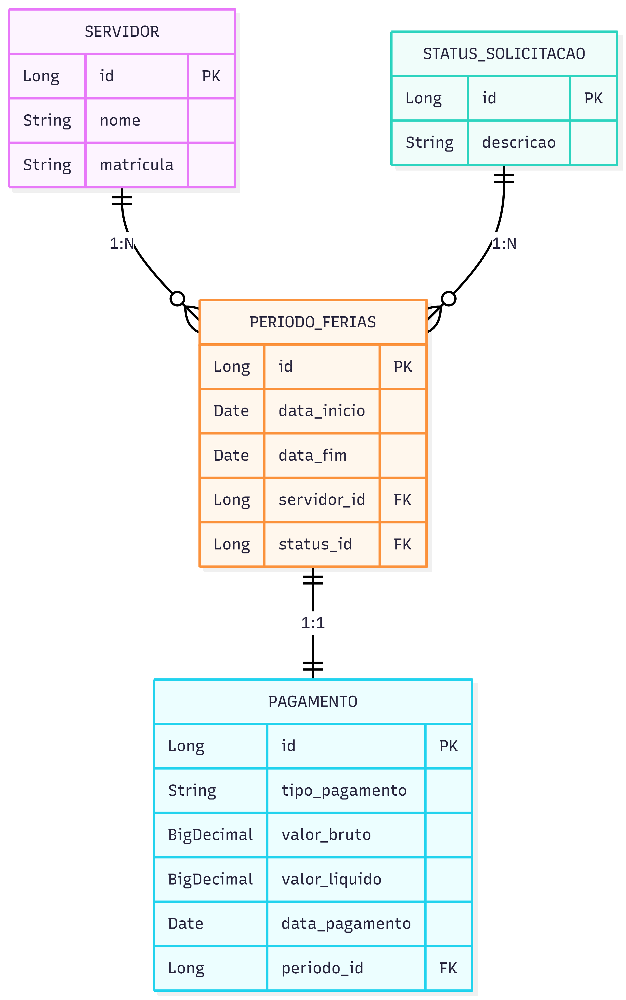

# Documentação do Projeto

Esta pasta contém os documentos de design e modelagem do sistema de Gestão de Férias.

## Conteúdo

### 📊 DER (Diagrama Entidade-Relacionamento)

O arquivo `DER-DesafioTecnico-SergipeTec-2025.png` contém o diagrama de banco de dados que representa:
- Estrutura das tabelas do sistema
- Relacionamentos entre as entidades
- Chaves primárias e estrangeiras
  

### 🎨 Protótipo de Baixa Fidelidade

O arquivo `PrototiposGestaoFerias.excalidraw` contém os wireframes do sistema:
- Tela de login
- Dashboard principal
- Listagem de férias
- Modais de ações

Para facilitar a visualização do arquivo do protótipo, use o [Excalidraw](https://excalidraw.com/#json=09ZWhkQszzgtffFAHRDeY,Us2CTo7WRUMEBX2TzeTUMQ) (link online)
