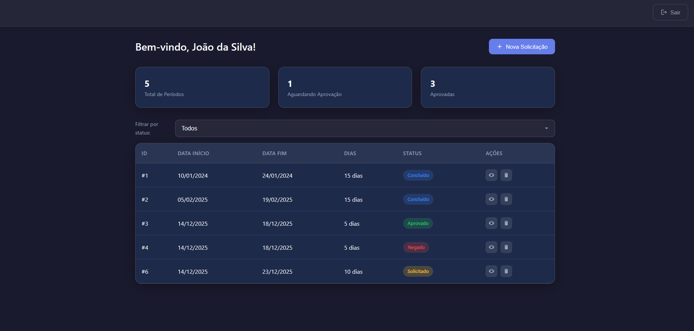

# Desafio Técnico - Sistema de Gestão de Férias

Sistema completo de gestão de férias para servidores, desenvolvido como prova técnica.




## 📁 Estrutura do Repositório

```
Desafio_Tecnico_Analista/
├── DOCS/                     # Documentação de design
│   ├── DER-*.png             # Diagrama Entidade-Relacionamento
│   └── Prototipos*.excalidraw # Protótipo de baixa fidelidade
├── frontend/                 # Código-fonte do Frontend (React/Vite)
│   └── src/                  # Componentes React
├── gestaoferiasAPI/          # Código-fonte do Backend (Java/Spring Boot)
│   └── src/                  # Código Java
└── README.md                 # Este arquivo
```

## 🛠️ Tecnologias Utilizadas

### Backend
| Tecnologia | Versão | Descrição |
|------------|--------|-----------|
| Java | 17 | Linguagem principal |
| Spring Boot | 3.5.8 | Framework web |
| Spring Data JPA | - | ORM/Persistência |
| MySQL | 8.0 | Banco de dados |
| Docker | - | Containerização |

### Frontend
| Tecnologia | Versão | Descrição |
|------------|--------|-----------|
| React | 19 | Biblioteca UI |
| Vite | 7 | Build tool |
| JavaScript | ES6+ | Linguagem |
| CSS3 | - | Estilização |

## 🚀 Como Executar

### Backend (Docker - Recomendado)
```bash
cd gestaoferiasAPI
docker-compose up --build
```
Acesse a API: **http://localhost:8080**

### Backend (Maven)
```bash
cd gestaoferiasAPI
./mvnw clean spring-boot:run
```

### Frontend
```bash
cd frontend
npm install
npm run dev
```
Acesse: **http://localhost:3000**

> ⚠️ O backend precisa estar rodando para o frontend funcionar corretamente.

## 📚 Documentação

| Documento | Descrição |
|-----------|-----------|
| [gestaoferiasAPI/README.md](./gestaoferiasAPI/README.md) | Documentação do Backend |
| [frontend/README.md](./frontend/README.md) | Documentação do Frontend |
| [DOCS/README.md](./DOCS/README.md) | Diagramas e Protótipos |

## 🧪 Dados de Teste

- **Matrícula**: `123456` (João da Silva)
- **Matrícula**: `654321` (Maria da Graça)
